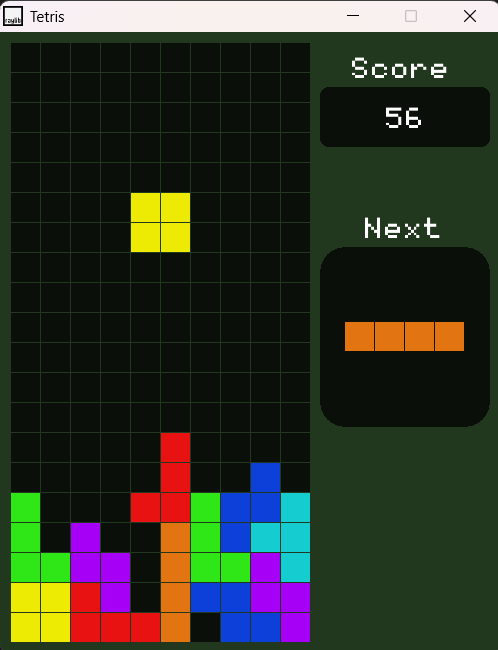

# Tetris in C++ (with raylib)

A colorful and modern take on the classic **Tetris** game, built in **C++** using **raylib** for graphics, following **Object-Oriented Programming** principles.  
Features a **scoring system**, **next piece preview**, and **vibrant colors and sounds** to make the gameplay engaging.

---

## Features

- **Classic Tetris Gameplay** – Rotate, move, and drop blocks to clear lines.
- **Vibrant Colors** – Each tetromino is uniquely colored for better visibility and style.
- **Scoring System** – Earn points for clearing lines and for pressing Down to drop a piece faster.
- **Next Piece Preview** – Plan your moves ahead by seeing the upcoming block.
- **Audio Feedback** – Background music, sound effects for block rotation, and line clearing.
- **Clean OOP Structure** – Classes for game objects, rendering, and logic separation.
- **Smooth Rendering** – Thanks to raylib's simple yet powerful graphics API.
- **Game Over Handling** – When the game ends, a _Game Over_ message is shown, and pressing any key starts a new game.

---

## 🖼 Screenshot

---

## Built With

- **C++17** – Core game logic and structure.
- **[raylib](https://www.raylib.com/)** – Graphics, input handling, audio, and rendering.
- **Object-Oriented Programming** – Encapsulated game entities for maintainable code.

---

## Gameplay

- **Move Left/Right**: Arrow Keys (← →)
- **Rotate**: Up Arrow (plays rotation sound)
- **Drop Faster**: Down Arrow (earns extra points)
- **Quit**: ESC
- **Clear Lines**: Earn points and play a line clear sound
- **Game Over**:
  - A _Game Over_ message appears.
  - Press **any key** to restart instantly.
- **Background Music** plays during gameplay.
